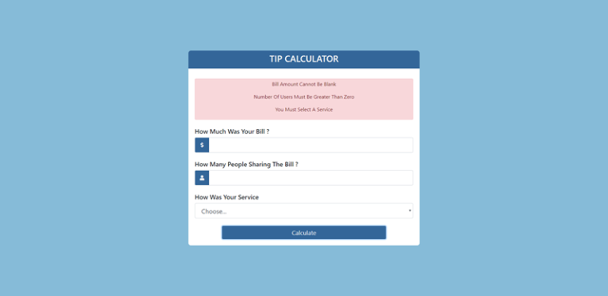

# Tip form

# What You Should See
1. In the case of tip form calculator above, you should be able to use the calculator to enter an amount of a bill, the number of people who will split the bill, and a selection as to how the service went.
2. If a user forgets to add input or if the input is blank (or less than zero), feedback should be alerted to the user and then go away after 5 seconds.
3. During the calculation, a GIF animation should show for a couple seconds before the user's answer show up on the screen.
4. After about 5 seconds, the calculator should reset all forms.

# JavaScript Used
* DOM Manipulation
* Control Structures
* Array.forEach()
* JavaScript CSS Manipulation
* eventListeners
* setTimeout()
* Immediately Invoked Function Expressions

# Project Description/Summary
This project involves using JavaScript to wire up a tip calculator.

# New Things Learned or Refreshed
I spent a lot of time on this project. Some of the things that I did:

* I broke up the feedback statement. Before breaking up the feedback statement, if there was an error in one spot, the user would get all three validation errors.
* I created two functions. One function handles error validation and the other handles the calculations for the tips.
* I add a validation statement to make calculations only if there were no errors. I did this by creating and returning a Boolean flag called ‘isFeedback' to indicated whether error feedback existed.
* I add the ‘toFixed(2)' method to my output to ensure two decimals in my output.
* I made the users output and the users input disappear from the form after five seconds to give visual feedback that the calculations were complete.

# Biggest Take Away(s)
I had yet another BUG in my code. I typed in setInterval() instead of setTimeout(). It didn't hit me until after watching my CSS mysterically appear and disappear in a fixed interval of about every 2 seconds. Then I was like, why are my CSS classes appearing and reappearing in set intervals?…Duh! One more takeaway but not necessarily a bug was when I used the HTML input form field. I tried to input a decimal number (18.67) but got an error. **When the HTML input has type=”number”, you have to add step=”0.1″ to set the interval to accept decimals.**

